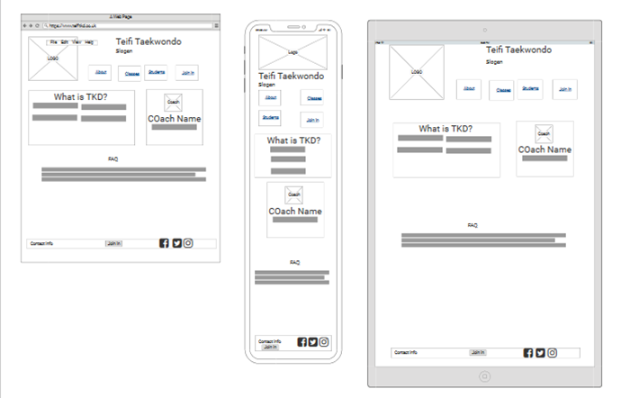

# Teifi Taekwondo
[View live project here](https://tloveday.github.io/teifi-tkd/)

This is the primary website for Teifi Taekwondo outside of the club's social media (inks to which are found within the footer). It is designed for the purposes of furthering the clubs reach, enhanced marketing with the goal of recruiting more students to the classes offered at the club. It is designed to be responsive and accessible on a range of devices, with simple navigation for prospective students and their parent/guardians.

Teifi Taekwondo is a fictional club based in St Dogmaels, Cardigan and is located on the banks of the River Teifi

## Mock Up

[Mock Up Template Created by Cosmo-Studio] (https://www.freepik.com/psd/mockup)
## User Experience

### New User
1. As a New user I wish to be able to find information about the main purpose of the club
2. As a New user I want to be able to easily navigate through the variety of pages to find the content and information I need (Class Times, location). 
3. As a new user I wish to find links to the clubs (and if appropriate the coaches) social media to view images of the classes.
4. As a new user I wish to be able to contact the club to arrange my first session.

### Returning User
- As a returning user I want to be abe to find information about classes quickly, information including class times pricing etc.

## Design Choices
### Colour schemes
The colours of the website are primarily off white and off black, symbols of the progress in Taekwondo. Alongside this for colour we have used a red and blue, traditional colours of competitors in competition. The four colours represent the colours of the flag of South Korea, the county from which originates Taekwondo from.

### Typography
The font Lexend was selected due to its vast open nature

### Imagery
The use of the images within the site all relate to the focus of the website. Whether it be coaches in their uniforms, students particpinating in classes. Iconography usually found within the class settings.
### Wireframes
 Home
 About
 Class
 Contact

### Languages Used
[HTML5](https://en.wikipedia.org/wiki/HTML5)

[CSS](https://en.wikipedia.org/wiki/CSS)

## Frameworks used
- [Bootstraps v5.0.0-beta3:](https://getbootstrap.com/)
   * Bootstrap was used to assist with the responsiveness and styling of the website.
- [Google Fonts](https://fonts.google.com/)
    * Google fonts were used to import the 'Lexend' and 'Poppins' fonts into the style.css file which is used on all pages throughout the project.
- [Font Awesome v5](https://fontawesome.com/)
    * Font Awesome was used on all pages throughout the website to add icons for aesthetic and UX purposes.
- [jQuery](https://jquery.com/)
    * jQuery came with Bootstrap to make the navbar responsive but was also used for the smooth scroll function in JavaScript
- [Git](https://git-scm.com/)
    * Git was used for version control by utilizing the Gitpod terminal to commit to Git and Push to GitHub.
- [GitHub](https://github.com/)
    * GitHub is used to store the projects code after being pushed from Git.
- [Procreate:](https://procreate.art/)
    * Procreate was used to create the logo and edit images where required. 
8 [Balsamic:](https://balsamiq.com/)
    * Used to create the wire frames

## Testing
Website was tested on a variety of browsers including Google Chrome, Safari, Firefox and Microsoft Edge.
The website was viewed on a variety of devices including desktop, laptop, iPad, iPhone, Samsung using both phyisical devices and browser development tools where they were availabe

The Website was provided to friends and family to review and obtain feedback on user experience and these included practitioners of  Martial Arts including a Sensei of a local Karate club with the focus on the intended user goals. Upon implementation of feedback they were asked to review the changes. 

Testing against User Goals
1. As a New user I wish to be able to find information about the main purpose of the club

Information on both the home and about page provide information about the purpose fo the club. It is recogniseable as a Martial Arts Club.

2. As a New user I want to be able to easily navigate through the variety of pages to find the content and information I need (Class Times, location).

Through the use of the Navigation Bar, users can easily hop between pages to find information on class times, club location, and even frequently asked questions. 

3. As a new user I wish to find links to the clubs (and if appropriate the coaches) social media to view images of the classes.

The social media links for the club are ever present in the websties foorter. Additional links to the Coaches' social media (that would have been created for the specific purpose) are found on the individuals coach card found on the about page.

4. As a new user I wish to be able to contact the club to arrange my first session.

The contact page is linked across several points on the website. In the Navigation bar found on the head of each page. A button at the centre of the footer, and in a button found in the indivdual cards found on the class page.
Additionally we have included the contact numbers for the senior coaches on the about and contact pages so that users who prefer to make phonecalls can use them. Additionally with the use of social media sould users wish to contact the club via direct message on those platforms the links to the indivdual and club specific social media are found in both the footer site wide, and in the coach's information found on the about page.

5. As a returning user I want to be abe to find information about classes quickly, information including class times pricing etc.

Like the new user information can be found quickly using the navigation bar and going to the appropriate page. Additionally for easier reading the inclusion of a table in the heading of the cards found on the classes pages provides clear information on What Day, When, Which Ages and Who can participate.

The W3C Markup Validator and W3C CSS Validator Services were used to validate every page of the project to ensure there were no syntax errors in the project.

[W3C Markup Validator](https://validator.w3.org/) 

[W3C CSS Validator Services](https://jigsaw.w3.org/css-validator/)

### Future Plans
Due to the clubs expansion the aim for the future is to include additional pages for current students. This page would include information on grading and competition dates, resource files to additional documentation incuding membership, insurance, and grading forms, alongside documentation relating to the club's syllabus.

Links would also be found to websties selected by the club for purchaing of equiptment or the creation of a club and site specific shop- due to the benefits clubs have in ordering equiptment. This would be dependant on the needs and preferences of the club.

## Bugs
There appears ot be several issues.
* There are occasions on lower screen sizes when images distort despite best efforts.
* Sometimes due to responsiveness text in card boxes bleeds into other sections.

## Problems
- After reviewing previous code taught and used in frameworks I came to question several times what I couldn’t get my Club logo to appear - confusion over directories was the key issue.
- Slow loading times - When testing pages my pages would load extremely slow - this was due to the use of images which were too big, after compressing the impages the problem reduced significantly.
- Finding issues getting my logo to appear large enough to be seen yet small enough to not be overpowering. 
- On class pages I positioned a shorter card representing the instructors taking those classes, however would regularly find my third instructor’s card would appear double the size of the coaches above. Due to a simplification and redesign these cards were ultimately removed as th pages were removed

## Deployment
### GitHub Pages
The project was deployed to GitHub Pages using the following steps...

1. Log in to GitHub and locate the GitHub Repository
2. At the top of the Repository (not top of page), locate the "Settings" Button on the menu.
3. Scroll down the Settings page until you locate the "GitHub Pages" Section.
4. Under "Source", click the dropdown called "None" and select "Master Branch".
5. The page will automatically refresh.
6. Scroll back down through the page to locate the now published site link in the "GitHub Pages" section.

### Forking the GitHub Repository
By forking the GitHub Repository we make a copy of the original repository on our GitHub account to view and/or make changes without affecting the original repository by using the following steps...

1. Log in to GitHub and locate the GitHub Repository
2. At the top of the Repository (not top of page) just above the "Settings" Button on the menu, locate the "Fork" Button.
3. You should now have a copy of the original repository in your GitHub account.

### Making a Local Clone
1. Log in to GitHub and locate the GitHub Repository
2. Under the repository name, click "Clone or download".
3. To clone the repository using HTTPS, under "Clone with HTTPS", copy the link.
4. Open Git Bash
5. Change the current working directory to the location where you want the cloned directory to be made.
6. Type git clone, and then paste the URL you copied in Step 3.

> $ git clone https://github.com/YOUR-USERNAME/YOUR-REPOSITORY

Press Enter. Your local clone will be created.

>$ git clone https://github.com/YOUR-USERNAME/YOUR-REPOSITORY
> Cloning into `CI-Clone`...
> remote: Counting objects: 10, done.
> remote: Compressing objects: 100% (8/8), done.
> remove: Total 10 (delta 1), reused 10 (delta 1)
> Unpacking objects: 100% (10/10), done.
Click Here to retrieve pictures for some of the buttons and more detailed explanations of the above process. 

## Credits
### Media
Logo for the club was designed and created by myself.

All images are for the website are Stock found at 
- Shutterstock: Dusan Petkovic, New Africa, Iakov Filimonov
- Adobe Stock ImagesL serhiibobyk, Catalin Pop

### Acknowledgements
* My mentor for providing clarity and support to what was quickly becoming a confusing project.
* Tutor support at Code Institute for their support. 